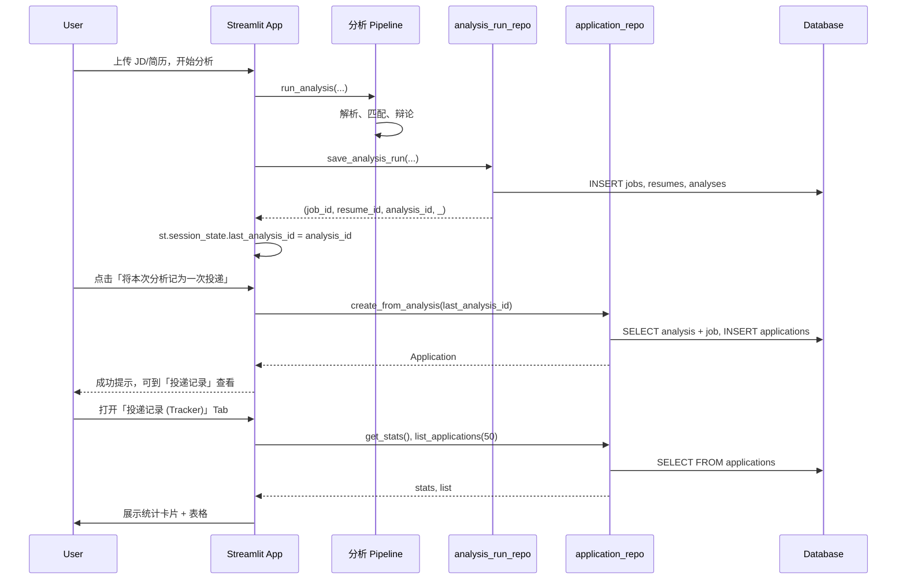

# 投递 Tracker 实现说明：通过分析创建 Application 与展示

本文档确认：**通过分析行为创建 `applications` 表记录** 的流程在本地与云端均可使用，并说明表结构与 Streamlit Tracker 的调用关系。

---

## 一、结论概览

| 问题 | 结论 |
|------|------|
| 能否通过「分析」行为创建 application 记录？ | **可以**。分析完成后入库得到 `analysis_id`，用户点击「将本次分析记为一次投递」或 Tracker 内「使用本次分析预填」会调用 `create_from_analysis(analysis_id)` 写入 `applications` 表。 |
| 本地与云端是否都支持？ | **都支持**。只要使用同一套数据库（`DATABASE_URL`），分析在何处执行都会写入 `analyses`/`jobs`，随后在任意端用 `analysis_id` 创建投递记录即可。云端部署时配置好 `DATABASE_URL` 与启动时执行 `init_database()` 即可。 |
| SQL 表是否按投递 Tracker 格式构建？ | **是**。`applications` 表由 [src/db/models.py](src/db/models.py) 中的 `Application` 模型定义，与文档中的投递 Tracker 字段一致。 |
| Streamlit Tracker 是否直接调用并展示该表？ | **是**。投递记录 Tab 调用 `get_stats()` 与 `list_applications(limit=50)`，用 `st.table()` 展示表格。 |

---

## 二、applications 表结构（与投递 Tracker 一致）

表名：`applications`，由 SQLAlchemy 的 `Base.metadata.create_all()` 根据 `Application` 模型创建（执行 `python -m src.db.init_db` 或应用启动时 `init_database()` 会创建缺失表）。

| 列名 | 类型 | 说明 |
|------|------|------|
| `id` | INTEGER PK | 主键，自增 |
| `analysis_id` | INTEGER NULL, FK(analyses.id), index | 关联的分析 id，可空（支持先记投递后补分析） |
| `company` | VARCHAR(255) NULL, index | 公司名称 |
| `role_title` | VARCHAR(255) NULL | 职位名称 |
| `jd_summary_or_link` | TEXT NULL | JD 摘要或链接 |
| `location` | VARCHAR(255) NULL | 地点 |
| `salary_range` | VARCHAR(255) NULL | 薪资范围 |
| `platform` | VARCHAR(100) NULL | 投递平台（如 Boss、拉勾、猎聘） |
| `initiated_contact` | BOOLEAN NULL | 是否主动沟通 |
| `resume_sent` | BOOLEAN NULL | 是否已投递简历 |
| `has_reply` | BOOLEAN NULL, index | 是否有回复 |
| `has_interview` | BOOLEAN NULL, index | 是否邀约面试 |
| `interview_rounds` | INTEGER NULL | 面试轮次 |
| `interview_feedback` | TEXT NULL | 面试反馈 |
| `offer_details` | TEXT NULL | Offer 详情 |
| `created_at` | DATETIME | 创建时间 |
| `updated_at` | DATETIME | 更新时间 |

---

## 三、通过分析创建 Application 的流程



- **分析侧**：`save_analysis_run()` 写入 `jobs`、`resumes`、`analyses`，并返回 `analysis_id`，前端保存为 `last_analysis_id`。
- **创建投递**：`create_from_analysis(analysis_id)` 根据 `analyses` 与关联的 `jobs` 预填公司、职位、地点、JD 摘要，再插入一条 `applications` 记录；可传 `platform`、`resume_sent`、`has_reply`、`has_interview` 等覆盖。
- **Tracker 展示**：`get_stats(from_date, to_date)` 做聚合；`list_applications(limit=50)` 查列表，Streamlit 用 `st.table(rows)` 展示。

---

## 四、关键代码位置

| 功能 | 位置 |
|------|------|
| 表定义（按 Tracker 格式） | [src/db/models.py](src/db/models.py) 中 `Application` 类 |
| 建表（本地/云端） | [src/db/init_db.py](src/db/init_db.py) 的 `init_database()`；[src/db/__init__.py](src/db/__init__.py) 在包首次被导入时调用，命令行与网页端共用，不在 app.py 内初始化 |
| 从分析创建一条投递 | [src/db/application_repo.py](src/db/application_repo.py) 的 `create_from_analysis(analysis_id, **overrides)` |
| 分析入库并得到 analysis_id | [src/db/analysis_run_repo.py](src/db/analysis_run_repo.py) 的 `save_analysis_run(...)`；[app.py](app.py) 分析成功后调用并设置 `last_analysis_id` |
| 前端「记为一次投递」按钮 | [app.py](app.py) 概览 Tab 内「将本次分析记为一次投递」，调用 `create_from_analysis(last_aid)` |
| Tracker 统计与列表 | [app.py](app.py) 投递记录 Tab 内 `get_stats()`、`list_applications(limit=50)`，表格展示 id、公司、职位、平台、已投简历、有回复、有面试、创建时间 |

---

## 五、实现步骤（按顺序执行即可）

1. **保证数据库有 `applications` 表**  
   - 初始化入口在 **src 内部**：[src/db/__init__.py](src/db/__init__.py) 在首次被导入时执行 `init_database(drop_existing=False)`。因此无论用户通过**命令行**（`main.py`）分析还是通过**网页端**点击分析，只要任一流程导入 `src.db`（如 `analysis_run_repo`、`application_repo`），表都会自动创建，无需在 app.py 里单独初始化。  
   - 若希望显式建表：在项目根目录执行 `python -m src.db.init_db`。

2. **分析流程**  
   - 在「JD 与简历分析」Tab：上传或使用 input 目录的 JD/简历 → 解析 → 选择大牛 → 开始分析。  
   - 分析结束后会调用 `save_analysis_run()` 写入 `jobs`、`resumes`、`analyses`，并得到 `analysis_id`，前端存为 `last_analysis_id`。

3. **创建投递记录**  
   - **方式 A**：在分析结果「概览」页点击「将本次分析记为一次投递」→ 调用 `create_from_analysis(last_analysis_id)`，用当次 Job 预填公司、职位、地点、JD 摘要，其余字段可为空（界面用占位「—」展示）。  
   - **方式 B**：打开「投递记录 (Tracker)」Tab → 展开「新增投递」→ 勾选「使用本次分析结果预填」→ 填写平台等 → 保存，同样走 `create_from_analysis(last_analysis_id, platform=..., ...)`。

4. **在 Tracker 中查看**  
   - 打开「投递记录 (Tracker)」Tab，会调用 `get_stats()` 与 `list_applications(50)`，表格展示所有列；未填字段在界面上显示为「—」。

---

## 六、是否需要重新初始化 SQL DB？

**一般不需要。**

- `init_database(drop_existing=False)` 只会执行 `Base.metadata.create_all()`，**只创建当前不存在的表**，不会删表、不会清空数据。  
- 只有在你想**清空并重建全部表**时，才需要执行带删表的逻辑（例如本地写脚本调用 `init_database(drop_existing=True)`，或手动删库文件再运行 `init_db`）。  
- 若之前已建过 `applications` 表，直接启动应用即可，无需「重新初始化」。

---

## 七、分析完成后 Application 各字段填写情况（空字段占位）

通过「将本次分析记为一次投递」或 Tracker 内「使用本次分析预填」创建记录时，数据来源与空值处理如下。**未填写的字段在数据库中为 NULL，在 Streamlit Tracker 表格中统一显示为占位「—」。**

| 字段 | 分析后是否可填 | 数据来源 / 说明 | 为空时展示 |
|------|----------------|------------------|------------|
| `id` | 自动 | 自增主键 | — |
| `analysis_id` | 自动 | 当次分析的 `analysis_id` | — |
| `company` | 是 | 来自关联的 `Job.company`（JD 解析结果） | — |
| `role_title` | 是 | 来自 `Job.title`（即 JD 的岗位名） | — |
| `jd_summary_or_link` | 是 | 来自 `Job.raw_jd_text` 前 500 字 | — |
| `location` | 是 | 来自 `Job.location` | — |
| `salary_range` | 否（仍为空） | JD 中若有薪资需后续在 Tracker 编辑或扩展解析 | — |
| `platform` | 可选 | 用户在「新增投递」或后续编辑时填写 | — |
| `initiated_contact` | 否（仍为空） | 需用户后续在编辑中勾选 | — |
| `resume_sent` | 是 | 默认 `True`（已投递简历） | —（表中用「是」/「否」，NULL 显示「—」） |
| `has_reply` | 可选 | 用户选择「是/否」时写入，否则 NULL | — |
| `has_interview` | 可选 | 同上 | — |
| `interview_rounds` | 否（仍为空） | 需后续编辑填写 | — |
| `interview_feedback` | 否（仍为空） | 需后续编辑填写 | — |
| `offer_details` | 否（仍为空） | 需后续编辑填写 | — |
| `created_at` / `updated_at` | 自动 | 插入/更新时由数据库写入 | — |

**小结**：分析后自动带出的只有「公司、职位、地点、JD 摘要、是否已投简历（默认是）」及 `analysis_id`；薪资、平台、主动沟通、回复/面试/Offer 等均为空或可选，界面用「—」占位，后续在 Tracker 编辑或新增时补全。

---

## 八、云端部署注意

- 设置 `DATABASE_URL` 指向云端数据库（如 PostgreSQL/MySQL）；若仍用 SQLite，需保证 data 目录可写且持久化。
- 表结构在首次导入 `src.db` 时由 [src/db/__init__.py](src/db/__init__.py) 自动创建（命令行或 Streamlit 任一路径都会触发），无需在 app 内或单独执行建表脚本（除非你希望显式执行 `python -m src.db.init_db`）。

按当前实现，**通过分析创建 application、按投递 Tracker 格式使用 applications 表、在 Streamlit Tracker 中直接调用并展示表格（空字段以「—」占位）** 均已打通，本地与云端行为一致。

---

## 九、两个测试流程（验证数据落库与 Tracker 展示）

### 测试 1：命令行分析并自动写入 applications

1. 将 JD、简历放入项目根目录下的 **`input/`**（文件名含 jd/job、resume/cv），或通过 `.env` 的 `INPUT_JD_PATH`、`INPUT_RESUME_PATH` 指定路径。
2. 在项目根目录执行：
   ```bash
   python main.py
   ```
3. 等待分析完成。若 `SAVE_TO_DB=true`（默认），会先写入 `jobs`、`resumes`、`analyses`，再**自动创建一条投递记录**到 `applications` 表，终端会打印：`已自动创建一条投递记录（applications 表，可在网页端「投递记录」Tab 查看）`。
4. 数据库文件位置：**`data/resume_analysis.db`**（默认 `DATABASE_URL=sqlite:///./data/resume_analysis.db`）。可用 SQLite 工具打开该文件查看 `applications` 表，或在下面测试 2 中用网页查看。

### 测试 2：网页分析并自动写入 applications，Tracker 始终显示表头

1. 启动 Streamlit：
   ```bash
   python -m streamlit run app.py
   ```
2. 在「**JD 与简历分析**」Tab：上传或使用 input 目录的 JD/简历 → 点击「解析 JD」「解析简历」→ 选择大牛 → 点击「开始分析」。
3. 分析完成后会入库并**自动创建一条投递记录**（与命令行一致），无需再点「将本次分析记为一次投递」。
4. 切换到「**投递记录 (Tracker)**」Tab：
   - **有数据时**：表格展示所有记录，空字段为「—」。
   - **无数据时**：仍展示**带表头的空表**（一行占位「—」），下方有说明文案，便于确认表格结构。
